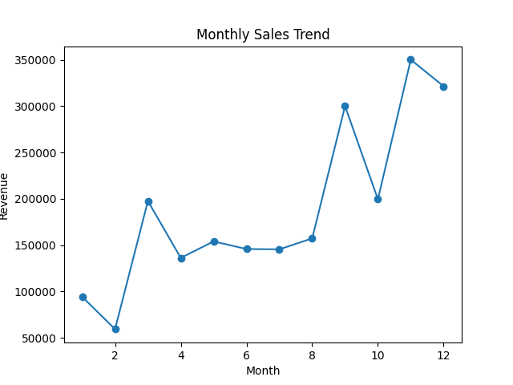
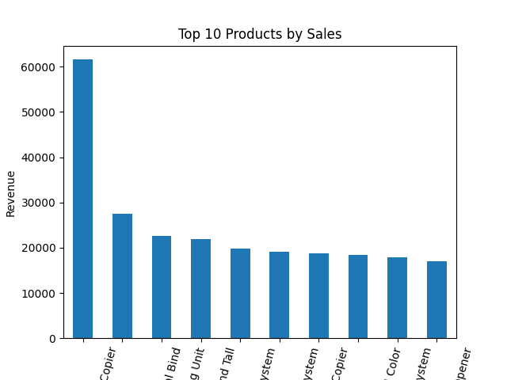
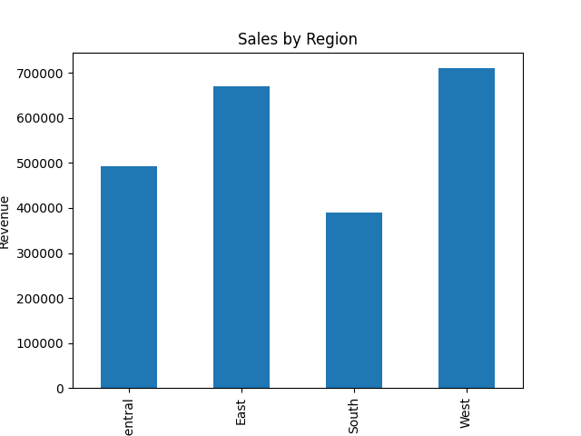

# Business Sales Performance Analytics

## Project Overview
This project analyzes retail business sales data to understand revenue patterns, product performance, and regional contribution. The goal is to extract meaningful business insights that support data-driven decision making.

## Tools & Technologies
- Python
- Pandas
- Matplotlib
- GitHub

## Dataset
Superstore Sales Dataset containing 9800 sales records with customer, product, and region details.

## Data Preparation
- Removed duplicate records
- Converted order date to datetime format
- Checked missing values

## Analysis Performed

### 1. Monthly Revenue Trend
Analyzed monthly sales to understand seasonal patterns and demand fluctuations.

### 2. Top Performing Products
Identified top 10 products generating highest revenue.

### 3. Regional Sales Performance
Compared revenue contribution across different regions.

## Key Findings
- Sales show noticeable variation across months indicating seasonality
- A small number of products generate large share of revenue
- Certain regions consistently outperform others

## Business Recommendations
- Focus marketing campaigns in high performing regions
- Maintain stock availability for top selling products
- Offer discounts during low revenue months to stabilize sales

## Visual Results

### Monthly Sales Trend

### Top Products

### Regional Performance

## Conclusion
The analysis demonstrates how business decisions can be improved using data analytics. By focusing on high-value products and regions, companies can increase profitability and optimize inventory planning.
